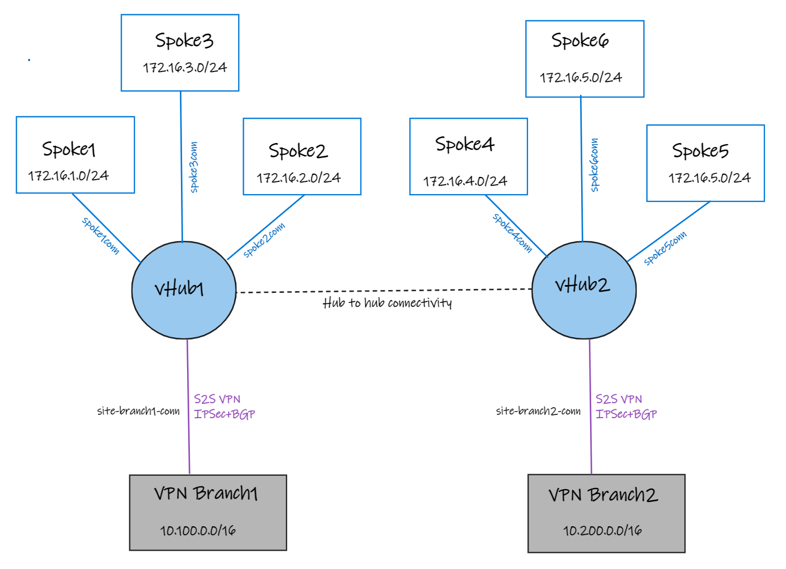

# Azure Virtual WAN Any-to-Any Hub Lab

Bicep implementation of the Azure Virtual WAN any-to-any routing lab. It deploys two Virtual WAN hubs, two simulated branches, six spokes, eight Ubuntu VMs, and redundant BGP-enabled site-to-site VPN tunnels.

## Architecture



Hub 1, Branch 1, and Spokes 1-3 deploy to the first supplied region. Hub 2, Branch 2, and Spokes 4-6 deploy to the second supplied region. All VMs default to `Standard_D2ls_v7`; branch gateways use `VpnGw1AZ` with zonal Standard public IPs.

## Prerequisites

- PowerShell 7
- Azure CLI (the deployment script prompts for sign-in when needed)
- Permission to create subscription deployments and resource groups

## Deploy

```powershell
.\deploy-bicep.ps1 `
  -ResourceGroupName '<resource-group-name>' `
  -Location '<hub-1-region>' `
  -Location2 '<hub-2-region>'
```

The resource group name and both hub regions are required. The script securely prompts for the VM administrator password and VPN pre-shared key (PSK). It uses the active Azure CLI subscription and discovers the caller's public IP for SSH access. Select a subscription or override the SSH source when needed:

```powershell
.\deploy-bicep.ps1 `
  -SubscriptionId '<subscription-guid>' `
  -ResourceGroupName 'my-vwan-lab' `
  -Location 'westus3' `
  -Location2 'eastus2' `
  -SshSourceAddressPrefix '203.0.113.10/32'
```

The VM username defaults to `azureuser`. Password authentication is enabled for SSH on all lab VMs.

No quota checks are performed. Virtual WAN and VPN gateway provisioning commonly takes 45-60 minutes. This lab creates billable gateways, public IPs, disks, and eight VMs.

## Files

- `main.bicep`: subscription-scoped orchestration and resource group creation
- `modules/network.bicep`: WAN, hubs, VNets, NSGs, spoke connections, and gateways
- `modules/virtual-machines.bicep`: Ubuntu test VMs and public IPs
- `modules/vpn-connections.bicep`: sites, local gateways, and IPsec/BGP connections
- `main.bicepparam`: non-secret defaults and environment-backed inputs

## Cleanup

```powershell
az group delete --name '<resource-group-name>' --yes --no-wait
```

## Credits & Source

This Bicep lab is adapted from Daniel Mauser's [Azure Virtual WAN any-to-any lab](https://github.com/dmauser/azure-virtualwan/tree/main/any-to-any).

Thanks to **Daniel Mauser** ([@dmauser](https://github.com/dmauser)) for creating and sharing the original scenario.
