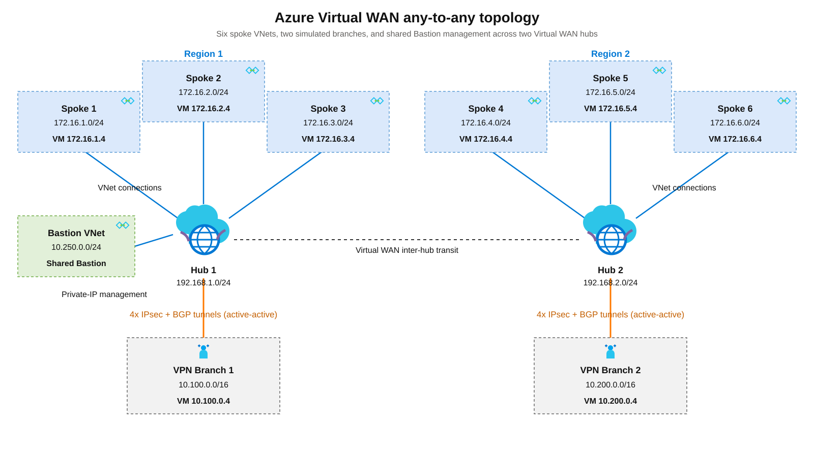

# Azure Virtual WAN Any-to-Any Hub Lab



*VM addresses in the diagram are illustrative; private IPs are dynamically allocated.*

This Bicep lab demonstrates native Azure Virtual WAN any-to-any routing across two hubs, six spoke VNets, and two simulated branches with BGP-enabled site-to-site VPN connections. A shared Azure Bastion host provides private-IP management across the topology. It is a private-connectivity lab, not an NVA or firewall deployment.

## Architecture and Routing

Each hub connects three local spokes and one simulated branch. Branches are Azure VNets with VPN gateways. Each hub and its local VNets deploy to the region you specify.

| Hub | Hub prefix | Local spokes / VNet prefixes | Local branch / VNet prefix | Branch ASN |
|---|---|---|---|---|
| `hub1` | `192.168.1.0/24` | `spoke1`: `172.16.1.0/24`; `spoke2`: `172.16.2.0/24`; `spoke3`: `172.16.3.0/24` | `branch1`: `10.100.0.0/16` | `65510` |
| `hub2` | `192.168.2.0/24` | `spoke4`: `172.16.4.0/24`; `spoke5`: `172.16.5.0/24`; `spoke6`: `172.16.6.0/24` | `branch2`: `10.200.0.0/16` | `65509` |

- **Spokes:** Connect directly to their local hub; Standard Virtual WAN provides inter-hub transit.
- **Branches:** Each `VpnGw1AZ` gateway runs active-active with two public IPs and two VPN sites, one per instance. Two branch-side connection resources connect both instances to both local hub endpoints: four IPsec/BGP tunnels per branch. Hub VPN gateways use ASN `65515` and scale unit `1`.
- **Management:** A Standard Bastion host in `bastion-vnet` (`10.250.0.0/24`) connects to Hub 1. Live validation confirmed private-IP SSH reachability to all eight VMs, including cross-hub spokes and both VPN branches.
- **Routing:** Connections rely on Azure's default route-table association and propagation. Branch-to-branch traffic is explicitly enabled. There are no custom route tables, static routes, or NVAs.

The lab deploys eight Ubuntu 22.04 VMs, two hub VPN gateways, two branch VPN gateways, and one Standard Bastion host. Each VM retains a public IP for outbound Internet access, but inbound SSH is allowed only from the Bastion subnet.

## Prerequisites

- **PowerShell 7+** and **Azure CLI with Bicep support**.
- **Contributor at subscription scope** or equivalent permissions. The template creates the resource group, so resource-group-only access is insufficient.
- Register **`Microsoft.Network`** and **`Microsoft.Compute`**.
- **Regional availability and quota** for the VM size in zone `1`, `VpnGw1AZ`, Standard Bastion, and Standard public IPs across zones `1`, `2`, and `3`. The script does not check these.

Gateways, Bastion, VMs, disks, and public IPs incur charges. Bastion is billed while deployed, even when idle. Allow time for provisioning and delete the lab when finished.

## Deploy

Clone the repository:

```powershell
git clone https://github.com/colinweiner111/azure-vwan-anytoany-hub-lab.git
cd azure-vwan-anytoany-hub-lab
```

Run from PowerShell 7, replacing the subscription ID and choosing a **new, dedicated** resource-group name:

```powershell
.\deploy-bicep.ps1 -SubscriptionId "<subscription-id>" -ResourceGroupName "vwan-anytoany-test01" -Location westus3 -Location2 eastus2
```

`-ResourceGroupName`, `-Location` (Hub 1), and `-Location2` (Hub 2) are required. Both hubs can use the same region; verify SKU availability in your chosen regions.

`-SubscriptionId` is optional; omitting it uses the active Azure CLI subscription.

The script will:
1. Prompt securely for missing secrets and validate the password (12–72 characters, three character classes, no control characters or disallowed passwords) and nonempty VPN pre-shared key
2. Sign in if needed and select the subscription
3. Verify whether the resource group is new or explicitly resumed
4. Deploy the subscription-scoped template

> **Use a new resource group.** The script rejects existing groups unless `-ResumeExisting` is explicitly supplied. Use that switch only when intentionally updating this lab.

This active-active topology is not an in-place migration of the earlier active-standby lab; deploy it to a new group to avoid leaving old VPN sites and connections.

Hub VPN connections deploy sequentially to avoid overlapping gateway updates. If this version partially fails, wait for gateway updates to finish before retrying the same lab group with the same settings and secrets. Persistent `Updating` states or repeated internal errors need investigation, not repeated deployments.

To intentionally update an existing deployment, supply its original regions and secrets:

```powershell
.\deploy-bicep.ps1 -SubscriptionId "<subscription-id>" -ResourceGroupName "<existing-resource-group>" -Location "<original-region-1>" -Location2 "<original-region-2>" -ResumeExisting
```

`-ResumeExisting` is only for a group already deployed with this active-active topology. Do not use it to migrate the earlier active-standby version; its old VPN sites and connections would remain orphaned. Delete that lab and deploy this version to a new group instead.

Use lab-only secrets: all VMs share the administrator credentials, and all VPN connections share the PSK.

### Configuration

| Setting | Value |
|---|---|
| VM username / size | `azureuser` / `Standard_D2ls_v7` |
| Hub regions | Required: `-Location` / `-Location2` |
| Branch 1 / Branch 2 / hub VPN ASN | `65510` / `65509` / `65515` |
| VM password / VPN PSK | Prompted securely unless supplied |

Use `-AdminUsername` to change the username. VM size and WAN name are configured in [main.bicepparam](main.bicepparam), not wrapper switches.

For direct use of that parameter file, set `AZURE_RESOURCE_GROUP_NAME`, `AZURE_LOCATION1`, `AZURE_LOCATION2`, `AZURE_ADMIN_PASSWORD`, and `AZURE_VPN_SHARED_KEY`. The wrapper sets and then removes these variables; use a dedicated shell if they already contain values you need.

## Validate

Run local compilation, topology assertions, and mocked deployment-script tests:

```powershell
pwsh -File .\tests\Test-Topology.ps1
pwsh -File .\tests\Test-DeploymentInputs.ps1
```

These tests do not deploy or verify Azure availability, provisioning, or live connectivity.

After deployment, find VM private IPs with `az vm list-ip-addresses --resource-group "<resource-group-name>" --output table`. Use `shared-bastion` to connect by private IP. The VM public IPs provide outbound Internet access but are not permitted as inbound SSH paths.

After deployment, confirm VPN/BGP connections and hub routes, then test between spokes and branches using their **actual private IPs**. Once `sudo cloud-init status --wait` completes successfully, `curl --fail --max-time 10 http://<destination-private-ip>/` should return the destination VM's hostname. Test both directions, including across hubs.

If Bastion or private routing is unavailable, use VM Run Command as a management-plane break-glass diagnostic:

```powershell
az vm run-command invoke --subscription "<subscription-id>" --resource-group "<resource-group-name>" --name "<vm-name>" --command-id RunShellScript --scripts "hostname; ip -br addr"
```

## Cleanup

Verify the active subscription and group name. This deletes **all resources** in the group:

```powershell
az group delete --name "<resource-group-name>" --yes --no-wait
```

Confirm deletion completes; `--no-wait` returns immediately.

## Credits & Source

- Daniel Mauser ([@dmauser](https://github.com/dmauser)), [Azure Virtual WAN any-to-any lab](https://github.com/dmauser/azure-virtualwan/tree/main/any-to-any) — original scenario adapted by this Bicep lab.
- [Virtual WAN any-to-any scenario](https://learn.microsoft.com/azure/virtual-wan/scenario-any-to-any) — Microsoft documentation for the routing design.
- [Connect a VPN Gateway to Virtual WAN](https://learn.microsoft.com/azure/virtual-wan/connect-virtual-network-gateway-vwan) — active-active gateway and VPN-site configuration.
